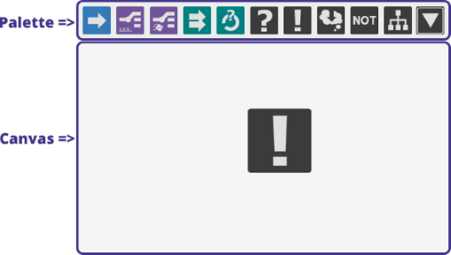
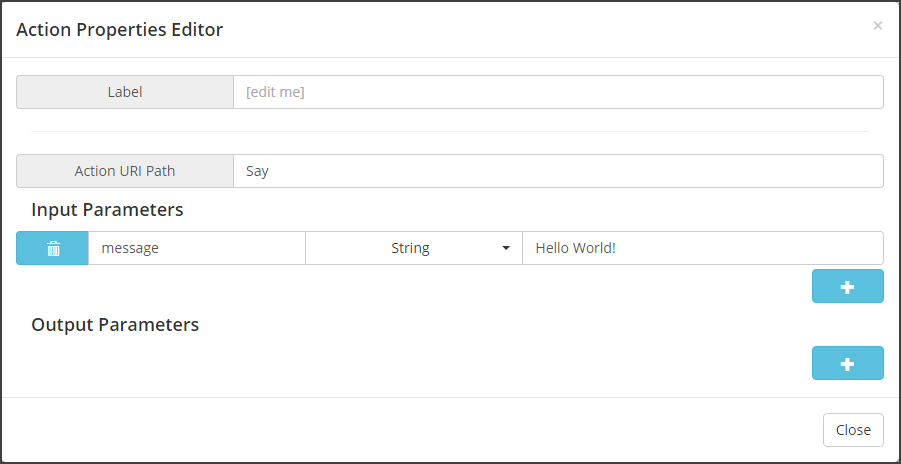

# Tutorial 1: Action node #

## Description ##

Here you will learn the basics of craft ai with the most simple behavior tree: a tree with a single action.

## Creating the behavior ##

To starting playing around with the behaviors, go to the [craft ai editor](http://editor.craft.ai/) and log in with your GitHub account.
Click on the `edit` (pencil) icon on the right of your **Tutorials** project: you will be redirected to the project explorer, in which you will find all the **behavior tree** (*.bt) files.

From this page you can add new **bt** files to your project by using the **Create new file** button from the menu.

> When creating a behavior tree, you have to specify the path of the file in the name. For example, if you want to add "behavior.bt" in the folder src/decision, you should fill the field with `src/decision/behavior`. the `.bt` extension is added automatically.

Create a new behavior tree file with the path `bts/tutorials/agent_0`. Validating the creation will display two more elements in the window: at the top you will find the **palette** with the list of available nodes, and just below is the canvas which will be the space where you will place the nodes and define the links between them, thereby constituting the behavior trees.

## Adding an action node to the behavior ##

From the palette, drag the [action node](http://doc.craft.ai/concepts_architecture/behaviors/index.html#action-node)  and drop it into the canvas below. The node will be added to the canvas and double clicking on it will open its properties editor. You will find the following properties:

- The `Action URI path` field where to input the name of the action that you want to call,
- The `Input Parameters` panel where to add as many inputs as needed,
- The `Output Parameters` panel where to add as many outputs as needed.

Both input and output parameters are defined by a name, a type and a value.

> Note that all properties are case sensitive.

Put "Say" as the `Action URI path` and add an `input parameter` named "message" with a `string` value "Hello World!". Save the file (using the Ctrl+S shortcut or the `Save` button in the toolbar).

Go to [the tutorial page](http://www.craft.ai/tutorials/) and run your fork of the **Tutorials** project with the `behaviors folder` field set to `bts/tutorials`.

Once the connection with the **craft ai** services has been initiated, you will see the line "Agent 0 says: Hello World!" being printed indefinitely, until you press the `stop` button.

> You can take a look at the expected result by running the application with `bts/1` as the `behaviors folder`.

That's it, you have your first home-made behavior! Pretty simple right? Not really smart though... now let's see how we can benefit from **behavior trees** to make it more complex in the following tutorials.
