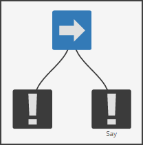
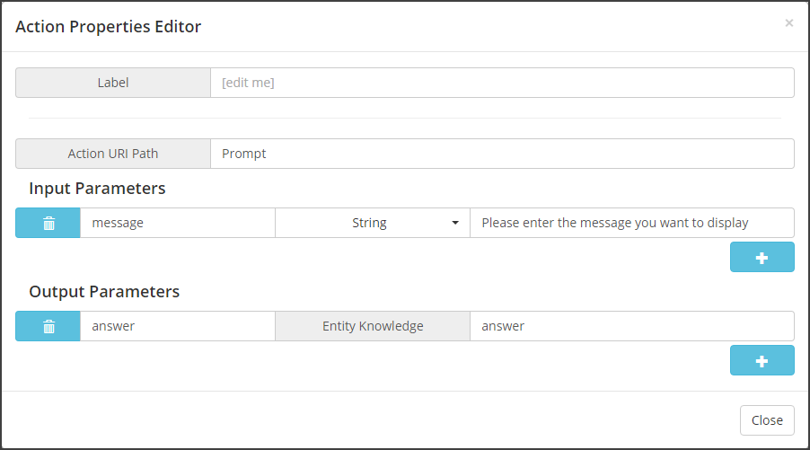
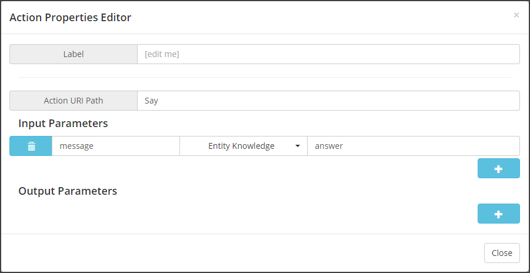

# Tutorial 2: Sequence node #

## Description ##

Use the sequence node to chain actions.

## Building the sequence in the behavior tree ##

In the "Tutorials" behavior tree that you previously created, drag the [sequence node](http://doc.craft.ai/concepts_architecture/behaviors/index.html#sequence-node)  to the canvas, just above the "Say" action so that the sequence node becomes the parent of the action node. Drag another action node on the left of the "Say" action to have the following behavior tree:

Set the leftmost action properties as described below:

This "Prompt" action displays a pop-up window with an input field. On submission, the [agent knowledge](http://doc.craft.ai/concepts_architecture/knowledge/index.html) will be updated with the value of the input stored under the key "answer".
Now you can use this as an input for your "Say" action. Simply double-click on it, and replace the type of the `message` input by "Entity knowledge" and the value by "answer".

Go to [the tutorial page](http://www.craft.ai/tutorials/): once connected to **craft ai** services, you will be prompted for a message to display. If you enter "Hi!" and hit "submit", the web page will display "Agent 0 says: Hi!", and the pop-up will reappear and so on.

> You can take a look at the expected result by running the application with `bts/2` as the `behaviors folder`.
